  <h1>Hi 👋, I'm MickLesk</h1>
  

  
<strong>Leading the way in Proxmox Virtualization & Home Automation.</strong>

  

---

### 🚀 Top Project

  

---

### 💡 About Me
* 🛠️ **Maintainer** of the [Proxmox Helper Scripts](https://github.com/community-scripts/ProxmoxVE)
* 🚀 **Founder** of [community-scripts](https://github.com/community-scripts)
* 🏠 **Passion** – Home Lab infrastructures and open-source ecosystems.

---

### 🔧 Tech Stack
**Languages:** `Shell/Bash` • `Go` • `Rust` • `TypeScript` • `Svelte`
**Core:** `Proxmox VE` • `Home Assistant` • `Docker` • `Linux` • `GitHub Actions`

---

### 🌟 Recommendations
`HomeAssistant` • `Zigbee2mqtt` • `ProxmoxVE` • `ByteStash` • `Checkmate` • `DrawIO` • `Immich` • `Mealie` • `Navidrome`

---

### 📊 GitHub Activity

  
  

  

